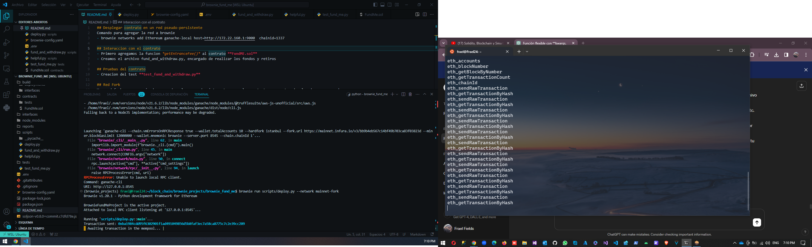
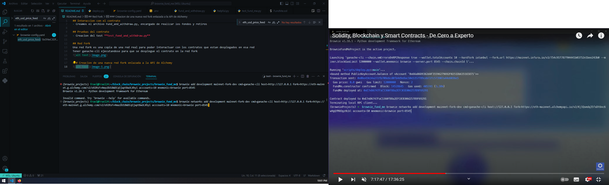
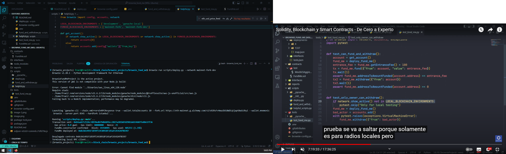
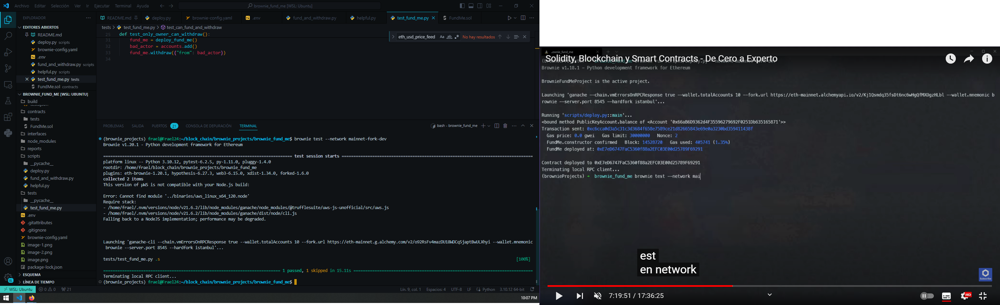

## Desplegar contrato en un red pseudo-persistente
Comando para agregar la red a brownie
- brownie networks add Ethereum ganache-local host=http://172.22.160.1:9000  chainid=1337

## Interaccion con el contrato
- Primero agregamos la funcion *getEntranceFee()* al contrato **FundME.sol**
- Creamos el archivo fund_and_withdraw.py, encargado de realizar los fondos y retiros

## Pruebas del contrato
- Creacion del test **test_fund_and_withdraw.py**

## Red Fork
Una red fork es una copia de una red real para poder interactuar con los contratos que estan desplegados en esa red
Tener ganache-cli ejecutandose para que se desplegue el contrato en la red fork

### Creacion de una nueva red fork enlazada a la API de Alchemy

Despliegue correcto del contrato en la red mainnet-fork-dev

Ejecucion del test correctamente
# brownie_fund_me
